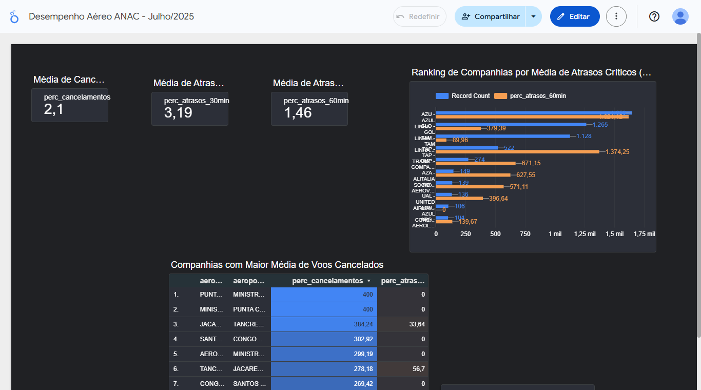

# Pipeline de Dados End-to-End: Análise de Voos da ANAC

## 📖 Visão Geral
Este projeto implementa um pipeline de dados completo para a ingestão, armazenamento, transformação e visualização de dados operacionais de voos da Agência Nacional de Aviação Civil (ANAC), referentes a Julho de 2025.

O objetivo é criar um dashboard interativo no Looker Studio que permita a análise de indicadores de pontualidade e cancelamentos, identificando as companhias e rotas mais críticas.

## ⚙️ Arquitetura do Projeto

CSV (Dados Brutos) ➡️ **Airflow** (Orquestração e Ingestão) ➡️ **PostgreSQL na Nuvem (Supabase)** (Armazenamento) ➡️ **dbt** (Transformação e Modelagem) ➡️ **Looker Studio** (Visualização e Dashboard)

## 🛠️ Tecnologias Utilizadas
* **Orquestração:** Apache Airflow
* **Contêineres:** Docker e Docker Compose
* **Banco de Dados:** PostgreSQL (Cloud - Supabase)
* **Transformação de Dados:** dbt (Data Build Tool)
* **Visualização de Dados:** Google Looker Studio
* **Linguagem:** Python (Pandas) e SQL

## 🚀 Como Executar o Projeto
1.  **Pré-requisitos:** Docker Desktop instalado e rodando.
2.  **Clone o repositório:** `git clone https://github.com/ricardoribs/pipeline-dados-anac.git`
3.  **Configure as credenciais:** Crie um banco de dados no Supabase e preencha as credenciais nos arquivos `meu_projeto_dbt/profiles.yml` e na conexão `postgres_anac` do Airflow.
4.  **Suba os contêineres:** Na raiz do projeto, execute `docker-compose up -d --build`.
5.  **Execute o Pipeline:**
    * Acesse o Airflow em `http://localhost:8080` e dispare a DAG `ingestao_dados_anac`.
    * Execute a transformação com o comando: `docker-compose exec airflow dbt run --project-dir /opt/airflow/dbt --profiles-dir /opt/airflow/dbt`.
6.  **Acesse o Dashboard:** Conecte o Looker Studio ao banco de dados Supabase e use a tabela `voos_limpos` como fonte de dados.

## 📊 Preview do Dashboard
**
